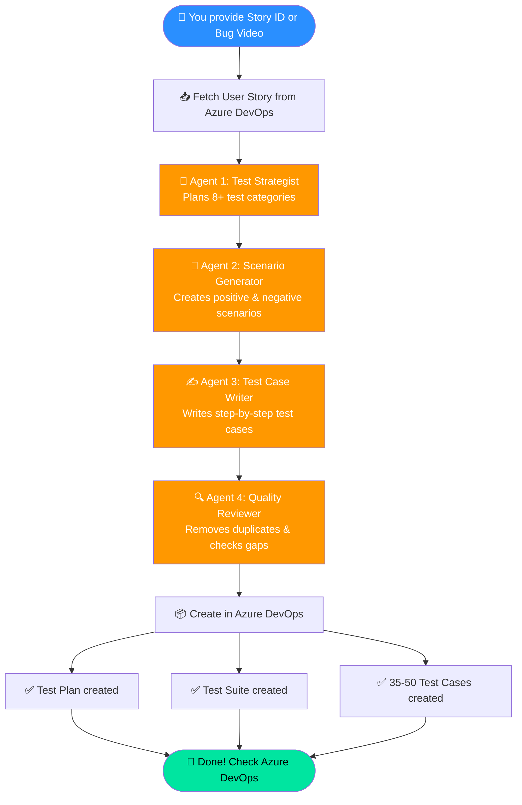
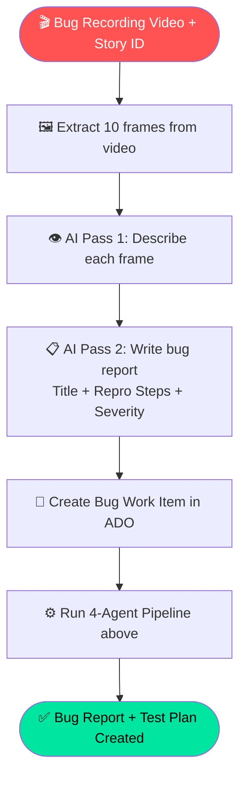
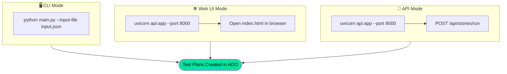

# TestForge — AI Test Plan Generator

Give it a User Story ID → It creates 35-50 test cases in Azure DevOps automatically.

---

## How This Project Works



### Bug Video Analysis Flow:



### System Architecture:

```mermaid
flowchart LR
    subgraph 📥 INPUT
        A1[input.json\nStory IDs + Bug Videos]
        A2[knowledge_base.json\nApp URLs, buttons, test data]
        A3[config/.env\nCredentials]
    end

    subgraph ⚙️ PROCESSING
        B1[main.py\n4 AI Agents + MCP]
        B2[api.py\nFastAPI Server]
        B3[index.html\nBrowser Dashboard]
    end

    subgraph 📤 OUTPUT
        C1[Azure DevOps\nTest Plans + Suites + Cases]
        C2[Azure DevOps\nBug Work Items]
        C3[output/ folder\nCSV Results]
        C4[logs/ folder\nExecution Logs]
    end

    A1 --> B1
    A2 --> B1
    A3 --> B1
    B3 -->|HTTP| B2
    B2 -->|calls| B1
    B1 -->|MCP| C1
    B1 -->|MCP| C2
    B1 --> C3
    B1 --> C4
```

### 3 Ways to Run:



---

## Setup

### 1. Install

```bash
pip install -r requirements.txt
```

**Requires:** Python 3.11+ and Node.js 20+

### 2. Create `config/.env`

```env
AZURE_OPENAI_ENDPOINT=https://your-resource.openai.azure.com/
AZURE_OPENAI_API_KEY=your-key
AZURE_OPENAI_DEPLOYMENT=gpt-4o
AZURE_DEVOPS_ORG=your-org
AZURE_DEVOPS_PROJECT=your-project
AZURE_DEVOPS_PAT=your-pat-token
```

### 3. Edit `knowledge_base.json`

Add your app URLs, login steps, button names, and test data.

---

## Run — CLI

```bash
# Stories + bugs together
python main.py --input-file input.json

# Stories only
python main.py --stories-file stories_input.json

# Bugs only
python main.py --bugs-file bugs_input.json
```

## Run — Web UI

```bash
# Step 1: Start server
uvicorn api:app --reload --port 8000

# Step 2: Open index.html in browser
```

Then: Validate connection → Add story IDs → Click Generate → View results.

## Run — API

```bash
uvicorn api:app --port 8000

# Generate test plans
curl -X POST http://localhost:8000/api/stories/run \
  -H "Content-Type: application/json" \
  -d '{"stories": [{"id": "28136"}]}'

# Check status
curl http://localhost:8000/api/jobs/{job_id}
```

---

## How It Works

```
User Story ID
  → Agent 1: Plans test categories (8+)
  → Agent 2: Creates scenario titles
  → Agent 3: Writes step-by-step test cases
  → Agent 4: Removes duplicates, checks quality
  → Creates Test Plan + Suite + Cases in Azure DevOps
```

For bugs: Upload video → AI describes each frame → Writes bug report → Creates test cases.

---

## Input Files

**input.json:**
```json
{
  "stories": [{ "id": "28136", "builder": "form_builder" }],
  "bugs": [{ "story_id": "28136", "video_path": "videos/recording.mp4", "builder": "form_builder" }]
}
```

Builder options: `form_builder` (default) or `dashboard_builder`.

---

## API Endpoints

| Method | URL | Purpose |
|---|---|---|
| GET | `/health` | Health check |
| POST | `/api/stories/run` | Generate test plans |
| POST | `/api/bugs/run` | Analyze bugs |
| GET | `/api/jobs/{id}` | Job status |
| GET | `/api/jobs/{id}/logs` | Live logs (SSE) |
| POST | `/api/upload/video` | Upload video |
| POST | `/api/config/validate` | Test connection |

---

## Project Files

| File | Purpose |
|---|---|
| `main.py` | Core AI engine (4 agents + ADO integration) |
| `api.py` | FastAPI server for UI/API |
| `index.html` | Browser dashboard |
| `knowledge_base.json` | Your app context (URLs, fields, test data) |
| `config/.env` | Credentials (never commit) |
| `input.json` | Input: story IDs and bug videos |
| `Dockerfile` | Container build for deployment |
| `docker-compose.yml` | One-command deployment |
| `videos/` | Bug recording videos |
| `output/` | Generated CSV results |
| `logs/` | Execution logs |

---

## Deploy for Your Team

### Option 1: Docker (Recommended)

```bash
# Build and run
docker-compose up -d

# Access at http://your-server:8000
# Open index.html in browser, set API URL to http://your-server:8000
```

### Option 2: Direct Server

```bash
pip install -r requirements.txt
uvicorn api:app --host 0.0.0.0 --port 8000
```

### Option 3: Azure App Service / AWS / Any Cloud

```bash
# Build Docker image
docker build -t testforge .

# Push to registry
docker tag testforge your-registry.azurecr.io/testforge
docker push your-registry.azurecr.io/testforge
```

---

## Use for Another Project

Any team can use this tool — just upload their own config files:

### Via UI (Settings Tab):
1. Open browser → Go to **Settings** tab
2. Upload your `knowledge_base.json` (your app's URLs, buttons, login steps)
3. Upload your `input.json` (story IDs to process)
4. Go to **Story Mode** → Click Generate

### Via API:
```bash
# Upload knowledge base
curl -X POST http://localhost:8000/api/upload/knowledge-base \
  -F "file=@your_knowledge_base.json"

# Upload input config
curl -X POST http://localhost:8000/api/upload/input-config \
  -F "file=@your_input.json"

# Run stories
curl -X POST http://localhost:8000/api/stories/run \
  -H "Content-Type: application/json" \
  -d '{"stories": [{"id": "12345"}]}'
```

### What Each Project Needs:

| File | What to Change |
|------|----------------|
| `config/.env` | Your Azure OpenAI key + ADO org/project/PAT |
| `knowledge_base.json` | Your app URLs, login steps, buttons, test data |
| `input.json` | Your story IDs |

---

## Troubleshooting

| Error | Fix |
|---|---|
| `npx not found` | Install Node.js 20+ |
| `MCP process exited` | Regenerate PAT token |
| `Knowledge base not found` | Check `knowledge_base.json` exists |
| `Video not found` | Use relative path: `videos/file.mp4` |
| `ModuleNotFoundError` | Run `pip install -r requirements.txt` |
| `WinError 10013` | Port in use — kill old process or use different port |
| Generic test steps | Fill in `knowledge_base.json` with real app details |

---

*TestForge — AI writes your test cases so you don't have to.*