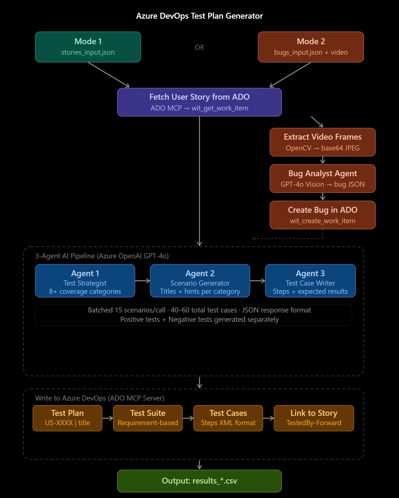
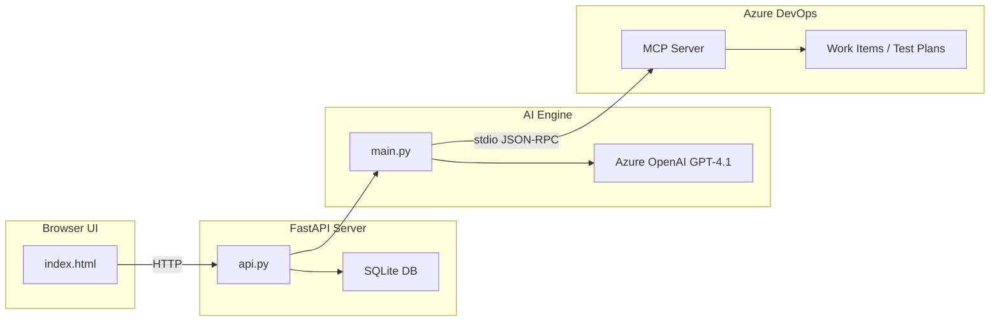
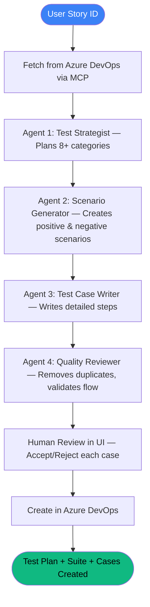

# AI TestForge

AI-powered Azure DevOps Test Plan Generator with multi-project support.

Give it a User Story → It generates 35-50 test cases with AI validation and creates them in Azure DevOps automatically.



---

## Features

- **Multi-Project Support** — Switch between multiple ADO projects from the topbar dropdown
- **4-Agent AI Pipeline** — Test Strategist → Scenario Generator → Test Case Writer → Quality Reviewer
- **Test Scenario & Strategy** — AI generates test scenarios with validated step flow
- **Priority & Severity Auto-Assignment** — AI assigns priority based on business impact
- **Bug Tracking & Leakage** — View bugs by priority, state, tag (Leakage), download CSV
- **Traceability Matrix** — Story ↔ Test Plan ↔ Test Case ↔ Bug links
- **CSV Import** — Import legacy test cases from CSV files
- **Exploratory Test Suggester** — AI suggests edge cases humans might miss
- **Test Execution Predictor** — Predicts which tests are likely to fail
- **Knowledge Base** — Upload project docs (JSON, PDF, TXT, MD, DOCX) for AI context
- **Description Upload** — Add description to stories missing one, directly from UI
- **Bug Video Analysis** — Upload video recordings → AI writes bug reports

---

## Architecture



---

## Quick Start

### 1. Install

```bash
python -m venv .venv
.venv\Scripts\activate     # Windows
pip install -r requirements.txt
```

**Requirements:** Python 3.11+ and Node.js 20+ (for ADO MCP server)

### 2. Configure

Create `config/.env`:

```env
AZURE_OPENAI_ENDPOINT=https://your-resource.openai.azure.com
AZURE_OPENAI_API_KEY=your-key
AZURE_OPENAI_API_VERSION=2024-02-01
AZURE_OPENAI_DEPLOYMENT=gpt-4.1

AZURE_DEVOPS_ORG=your-org
AZURE_DEVOPS_PROJECT=your-project
AZURE_DEVOPS_PAT=your-pat-token
```

### 3. Run

```bash
uvicorn api:app --reload --port 8000
```

Open **http://localhost:8000** in your browser.

---

## How It Works



---

## Multi-Project Usage

1. Click **"+ Project"** in the topbar
2. Fill in project name, ADO org, project, PAT, and OpenAI key
3. Click **Save Project**
4. Switch between projects using the **dropdown** in the topbar
5. Each project's stories, bugs, and history are isolated

---

## UI Panels

| Panel | Purpose |
|---|---|
| **Configuration** | Add/edit/switch projects, manage credentials |
| **Knowledge Base** | Upload project docs for AI context |
| **User Stories** | Load stories from ADO, filter by state, view details |
| **Review Cases** | Accept/reject AI-generated test cases before creation |
| **Confirmation** | Shows created test plan links after ADO upload |
| **Bugs & Leakage** | View bugs with priority/state/leakage filters, download CSV |
| **Traceability** | Story ↔ Plan ↔ Suite ↔ Case ↔ Bug matrix |
| **CSV Import** | Import existing test cases from CSV |
| **Exploratory AI** | AI suggests edge cases for selected stories |
| **Failure Predictor** | Predicts which tests are likely to fail |
| **Run History** | View past test plan generation runs |
| **Output Files** | Download generated CSV files |

---

## API Endpoints

| Method | Endpoint | Purpose |
|---|---|---|
| GET | `/health` | Health check + MCP status |
| GET | `/api/session/config` | Get active session config |
| POST | `/api/session/config` | Save session config |
| GET | `/api/configs` | List all saved projects |
| POST | `/api/configs` | Save/update a project |
| DELETE | `/api/configs/{id}` | Delete a project |
| GET | `/api/stories/list` | List user stories (with state filter) |
| GET | `/api/stories/fetch/{id}` | Get full story details |
| POST | `/api/stories/update-description` | Update story description in ADO |
| POST | `/api/generate/preview` | Generate test cases (AI pipeline) |
| GET | `/api/review/{id}` | Get review status and test cases |
| POST | `/api/review/accept-case` | Accept/reject a single test case |
| POST | `/api/review/accept-all` | Accept all test cases |
| POST | `/api/review/create-in-ado` | Create accepted cases in ADO |
| GET | `/api/bugs/list` | List bugs with filters |
| GET | `/api/bugs/download` | Download bugs as CSV |
| POST | `/api/upload/knowledge-base-multi` | Upload KB (JSON/PDF/TXT/MD/DOCX) |
| GET | `/api/output/files` | List output files |
| GET | `/api/runs/details` | Get run history |

---

## Project Structure

```
├── api.py                  # FastAPI server + all endpoints
├── main.py                 # Core AI engine (4 agents + MCP client)
├── index.html              # Single-page UI (served by FastAPI)
├── config/.env             # Credentials (never commit)
├── knowledge_base.json     # Project context for AI
├── testforge_config.db     # SQLite — projects + run history
├── requirements.txt        # Python dependencies
├── Dockerfile              # Container build
├── docker-compose.yml      # One-command deployment
├── output/                 # Generated CSV results
├── logs/                   # Execution logs
├── input/                  # Video/file uploads
└── videos/                 # Bug recording videos
```

---

## Deployment

### Docker

```bash
docker-compose up -d
# Access at http://localhost:8000
```

### Direct

```bash
pip install -r requirements.txt
uvicorn api:app --host 0.0.0.0 --port 8000
```

### Cloud (Azure App Service / AWS / Any)

```bash
docker build -t ai-testforge .
docker tag ai-testforge your-registry.azurecr.io/ai-testforge
docker push your-registry.azurecr.io/ai-testforge
```

---

## CLI Mode

```bash
# Stories mode
python main.py --stories-file stories_input.json

# Bugs mode (video analysis)
python main.py --bugs-file bugs_input.json

# Combined
python main.py --input-file input.json
```

---

## Tech Stack

- **Backend:** Python 3.11+, FastAPI, Uvicorn
- **AI:** Azure OpenAI GPT-4.1 (4-agent pipeline)
- **ADO Integration:** Azure DevOps MCP Server (JSON-RPC over stdio)
- **Database:** SQLite (projects, run history)
- **Frontend:** Vanilla HTML/CSS/JS (single file, dark theme)
- **Deployment:** Docker, docker-compose
